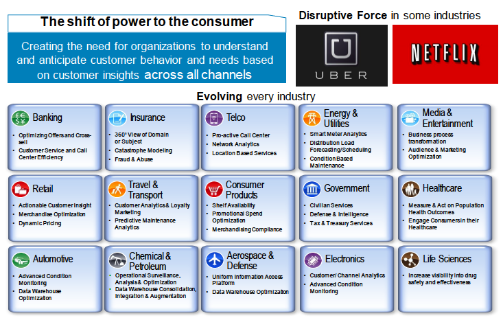

# Data Warehousing

# ToC

* [Week 1 - Intro to Data Warehousing](#introduction-to-data-warehousing)  
* [Week 2 - Business Requirements and Business Process Dimension Models](#business-requirements-and-business-process-dimension-models)  

# Introduction to Data Warehousing

## Basic Concepts

* Companies run their businesses with **OLTP (On-Line Transaction Processing)** - also known as "Systems of Record"
  * These systems track everything that happens in a system. 
  * Sales suport, order tracking, banking actions, customer support etc.
  * Everytime a customer does something with a business, there's always a record what we call **transactions**
  * These **transactions** are stored somewhere, a database.
  
* Companies want to know things about their business (perform analytics)
  * Businesses wants to know a certain **meaning out of this data**.
  * This desire to perform analytics on the data that is stored called **analytics**
    * Report on results
    * Historical analysis
    * Identify trends
    * Predict future results
  
* This can be accomplished in a couple of ways: 
  1. Directly against the **OLTP** system
  2. Building a dedicated Data Warehouse system (**OLAP**)
  
### What is a Data Warehousing?
  * Data Warehousing is a system used for reporting and data analysis
  * Data Warehouses are a central repository for data from one or more sources
  * Data Warehouses store current and historical data

### **Terms** used with Data Warehousing?
  * Warehousing
  * Analytics
  * Operational Analytics
  * Mining
  * Enterprise Data Warehouses (EDW)
  * Operational Data Store (ODS)
  * Physical Data Marts
  * Logical Data Marts
  * On-line Analytic Processing (OLAP)
  
### **ETL and ELT** (Extract Transform Load and Extract Load Transorm)
  * How data moves in the infrastructure which includes a Data Warehouse
  
* **DSS** (Decision Support System ) 
  * Turning data into information
  
* **Mixed workloads** vs **dedicated analytic platforms**
  * Benefits of optimizing systems for a particular workload
  * Mixed workloads - where we insert our analytical queries directly in transactional system (OLTP)

### Data Warehouse **characteristics**
  * Batch based vs continual data ingest
  * Cleansed - most time consuming and costly process
  * Re-structured
  * Optimized for reporting, querying, analytics
  * Organizes data into non-volatile, subject-specific groupings
  * Multiple data sources
  
### On-line Analytic Processing (OLAP)
  * Relational OLAP (ROLAP)
  * Multi-dimensional OLAP (MOLAP)
  * Facts, Dimentsions, Start-Schema, Snowflake, Hierarchies, Cubes

* What is **EDW (Enterprise Data Warehouse)** ?

  * It's  combination of:
   1. Copy of Operational Systems
   2. Trusted Data
   3. Deep analytics & modeling
   4. Reporting & interactive analysis
   
  
  
* Follow up to this course is a **Big Data** 

### Big Data - Impact Accross the marketplace

* Every industry is modernizing their data by augmenting it in a data warehouse.

  

### Market Observations

1. There's increasing pressure to perform analytics where data gets created.
2. Event-driven applications will enable new analytic use cases
3. Business applications are leveraging both SQL and NoSQL data in structured repositories for analytics
4. Hybrid cloud capabilities of software support economies of scope
5. Private cloud needs cloud-scale convenience.
6. Diverse data sources support an ecosystem of innovation

### Some Interesting Data Points

* We are in the beginning of big data / cloud journey
   
 
 
### Data Professionals 

* Some of the hot jobs currently in the market, and their role in addressing evolving data.  
  
  
  

### Artificial Intelligence - Massive Driving Force

* Machine Learning is about computers being able to self-learn and  make decisions, do things without being programmed to do so.  

* In the context of DW, machine learning comes to play when the computer can re-model data structure to optimize and continually refine themselves to be accurate.  

* Data is core: AI requires a LOT OF DATA

   

  
   
[🔝](#toc)  
  
  
# Business Requirements and Business Process Dimension Models

* Kimball Lifecycle

This is basically a diagram outlining the various flows and objects required in a data warehouse. As we go through this topic, we'll touch on every box on this diagram.

We're going to talk about **dimentional modelling** and **business requirements**

## Business Requirement

* Data Warehouse shouldn't be built based on IT, rather **should be business driven**
* IT organization is ultimately responsible for **implementation**, but all the sponsorship and drive will come from the busines side.

* **Data Warehouse** - most lines of businesses have their own unique requirements. 
  * Internet
  * Landline
* **Enterprise-level Data Warehouse** - strategy that crossess all lines of businesses and pulls all the warehouses together.
  * Enterprise-leve business requirements:
    - Conduct business and IT interviews
    - Conduct reviews of enterprise requirements
    - Well defined success criteria
    - Data Auditing / Data Profiling
    - Interview Summary
    - Business Requirements category to supporting business process:
    
    
    
* From these requirements, comes the mapping to some of the analytics we may want do, or some of the business processes it's going to affect. 
    
* In Summary it's very important to address the business requirements correct, otherwise the work your IT staff will be doing is going to be a waste.

### Process Gathering Business Requirements

* Enterprise-level business requirements:
  * Business matrix
  
  
* Prioritize business requirements
  * Business value impact vs feasibility
  
* Planning the project
  * Break overall business requirements into individual projects
  * A project is a row in Figure 1-7.
* Project level business requirements
  * Same process as used for business requirements

## Dimension Model Concepts

* Goal: Make sure the users get access to the data they need

* Dimensional Model
 * Heart of the DW/BI system
 * Target of the ETL system
 * Structure of the physical database
 * Model behind tghe query and reporting applications

* :exclamation: Dimensional Model Success Criteria:

1. Simple
2. High performance
3. Relevant / Accurate

## The Star Schema

One of the popular model of the dimensional model data warehouse
 
 
 
* Location of Dimension Model in Analytics Platform

   
 

## Fact Table

Nothing more than a table. 

* Fact Table contains the measurements associated with something happening with the businesness process that we're studying.

* Usually the primary key of a fact table contains multiple parts which map to dimension tables.

* Fact tables are very granular, atomic.
  * For example, buying separate items in a grocery store. Each scan is a fact.

* :exclamation: Three fact table types
  1. Transaction
  2. Periodic snapshot
  3. Accumulating Snapshot
  
  
* Fact tables are **NOT** normalized - repeated information is fine (like city)

### Grain of a Fact Table

* Fact table consists of measurements of a business process
* The grain is the description of the measurement event in the physical world that gives rise to a measurement
* The grain of the dimensional model is the finest level of detail that is implied when the fact and dimension tables are joined
* Fact tables are usually large - 90% of the data in the star schema
 
### Fact Table - usual columns

  

## Dimension Model - Concepts

* Tables in a database
* Dimension tables are NOT normalized
* Dimension table are designed for: 
  * Simplification
  * Performance
* Spotting dimensions
  * "by" ... "group by", "order by"
* Ability to re-use dimensions is key to enterprise data warehouse concept
* Conformed dimension
* Drill Across

### Conformed Dimensions

* When two business processes use the exact same product dimension with the same keys, they use a **conformed dimension**
* Conformed dimensions are the cornerstone of the **enterprise-enabled DW/BI system**
* This kind of analysis involving data from more than one business process is called drill accross

 

